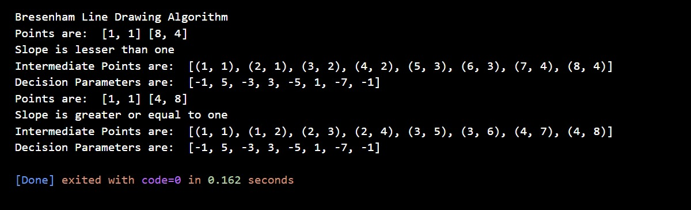
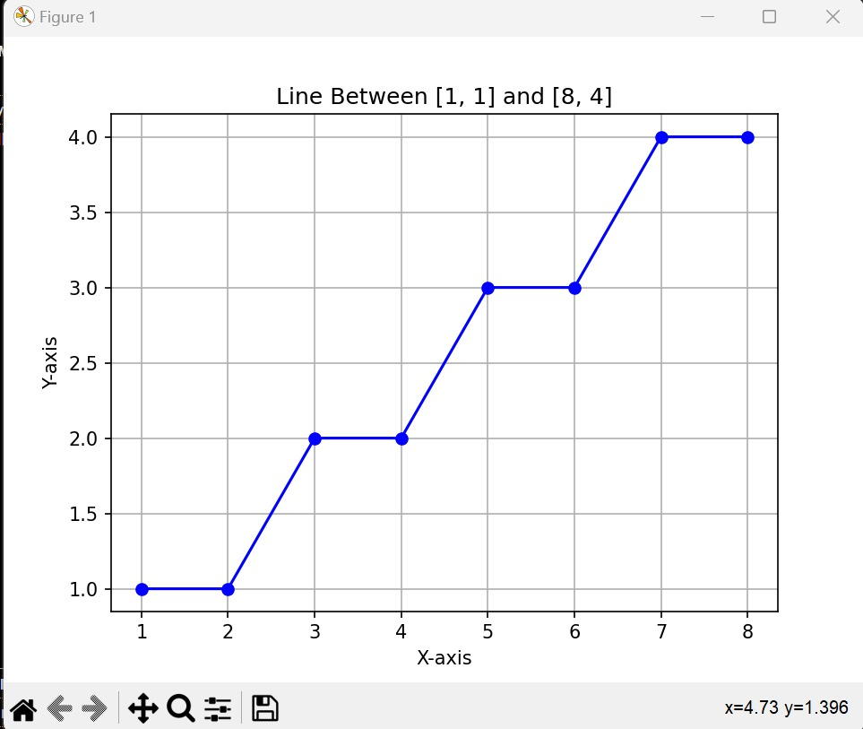
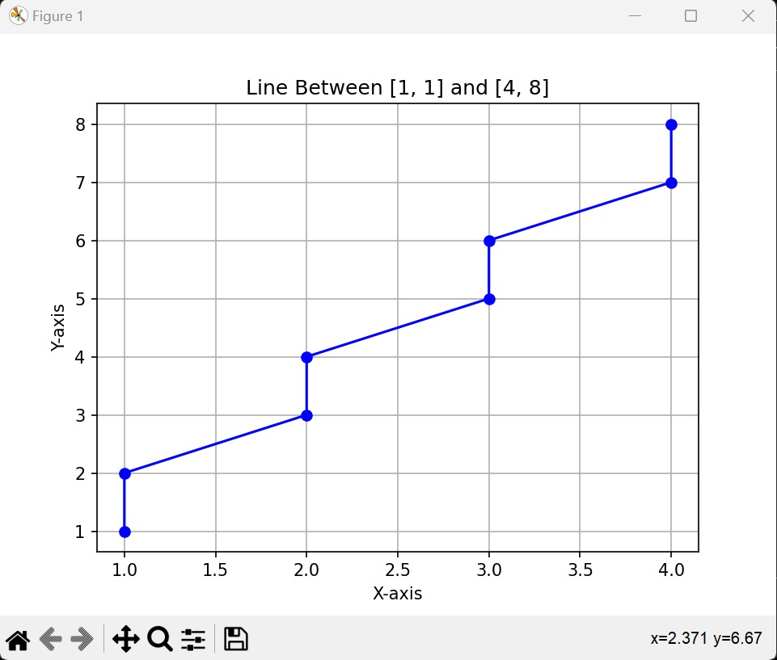

# Bresenham's Line Drawing Algorithm
This file describes the implementation of Bresenham's line drawing algorithm, efficient for drawing lines on digital displays using only integer arithmetic.

### Algorithm Description
Bresenham's algorithm iteratively determines the pixels that approximate a straight line between two given points. It avoids floating-point operations, making it faster on systems without dedicated floating-point units.

### Implementation Details
This implementation relies on integer variables and calculates an "decision parameter" to guide pixel selection. It achieves high accuracy and efficiency.

## Explanation of Adjustments

The adjustments made to Bresenham's Line Drawing Algorithm for slopes \( m > 1 \) are crucial for accurately rendering lines with steep inclines. Let's break down each adjustment:

1. **Setting Up Initial Parameters**:
   - In lines with slopes \( m > 1 \), the change in y-coordinates (\( \Delta y \)) tends to be greater than the change in x-coordinates (\( \Delta x \)). Therefore, the decision parameter (\( p \)) is initialized based on the difference between \( \Delta y \) and \( \Delta x \).
   
2. **Looping Over y-coordinates**:
   - Since the y-coordinate changes more rapidly in lines with steep slopes, the algorithm loops over the y-coordinates and calculates the corresponding x-coordinates. This ensures that the line is accurately represented by selecting the appropriate pixels.
   
3. **Updating the Decision Parameter \( p \)**:
   - Within the loop, the decision parameter \( p \) is updated to determine the next pixel to be plotted. Adjustments are made to correctly handle cases where \( p \) is less than zero or greater/equal to zero, ensuring that the line is drawn smoothly without missing any pixels or artifacts.

In summary, these adjustments are needed to adapt Bresenham's algorithm to handle lines with slopes greater than one effectively. By considering the specific characteristics of such lines, the algorithm can ensure precise rendering and maintain visual integrity in the resulting line drawings.

### Overall Output

### Explanation of Outputs and Intermediate Points

Let's break down how the code snippet produces the outputs and intermediate points for the given cases:

#### Case 1: (1,1), (8,4)

1. **Points Printing**: The function prints the given points: (1,1) and (8,4).
2. **Slope Identification**: Since the slope \( m = \frac{{\Delta y}}{{\Delta x}} = \frac{{4 - 1}}{{8 - 1}} = \frac{3}{7} \) is less than one, the function prints "Slope is lesser than one".
3. **Initialization**: The function initializes the decision parameter \( p = 2 \Delta y - \Delta x \) and sets the starting point as (1,1).
4. **Bresenham's Algorithm Execution**: The algorithm iterates over the x-coordinates from 1 to 8, appends the current point (x, y) to the list of intermediate points, and updates the decision parameter \( p \).
5. **Intermediate Points Printing**: The function prints the intermediate points calculated by the algorithm.
6. **Visualization**: Finally, it displays a plot showing the line between the points (1,1) and (8,4) using matplotlib.

- **Case 1**: Line from (1,1) to (8,4) - Represents a slope where 0 < m < 1.

#### Case 2: (1,1), (4,8)

1. **Points Printing**: The function prints the given points: (1,1) and (4,8).
2. **Slope Identification**: Since the slope \( m = \frac{{\Delta y}}{{\Delta x}} = \frac{{8 - 1}}{{4 - 1}} = \frac{7}{3} \) is greater than one, the function prints "Slope is greater or equal to one".
3. **Initialization**: The function initializes the decision parameter \( p = 2 \Delta x - \Delta y \) and sets the starting point as (1,1).
4. **Bresenham's Algorithm Execution**: The algorithm iterates over the y-coordinates from 1 to 8, appends the current point (x, y) to the list of intermediate points, and updates the decision parameter \( p \).
5. **Intermediate Points Printing**: The function prints the intermediate points calculated by the algorithm.
6. **Visualization**: Finally, it displays a plot showing the line between the points (1,1) and (4,8) using matplotlib.

- **Case 2**: Line from (1,1) to (4,8) - Represents a slope where  m > 1.

In summary, the outputs and intermediate points are obtained by executing Bresenham's Line Drawing Algorithm based on the given points and slope, and visualizing the result using matplotlib.

## Author

* Sanjana Afrin (Reg: 2019831054 | SWE - IICT | SUST)

